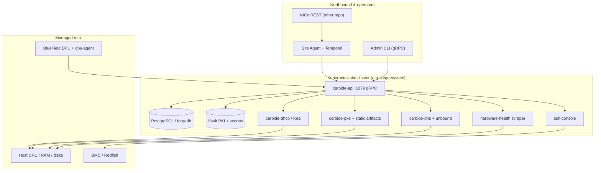

# Weekly report — NCX Infra Controller Core (NICo)

**Week label:** 2026-W17  
**Calendar span:** 2026-04-17 – 2026-04-23  
**Upstream HEAD:** `7b35ff0` (`7b35ff0d207a93fbec00f478c017b77b07f4e394`)  
**Repo:** https://github.com/NVIDIA/ncx-infra-controller-core  

---

## 1. Executive pulse

- **What this system is (one sentence):** NICo is the **site-local robot** that turns racked bare metal into **cataloged, trusted, network-bootable** machines—without someone hand-DHCP’ing, hand-imaging, or hand-tracking firmware on every box.
- **How it stays safe:** Components talk over **mTLS’d gRPC**; DPUs and BMC paths are used so the **host is not trusted** until the control plane says it is.
- **What moved this week (from git):** see §3. If the list looks short, widen the window (`--days 14`) or deepen your clone (`git fetch --unshallow`).

---

## 2. Current solution topology

### 2.1 Picture in your head (plain English)

Think of **three layers**:

1. **North / human & cloud:** Operators and automation hit **NICo REST** (separate repo) or **Site Agent** (Temporal northbound). Those requests become **gRPC** into the core running on the site cluster.
2. **Middle / “site controller” on Kubernetes:** `carbide-api` is the **brain** (state in Postgres, secrets in Vault, identities via cert-manager/SPIFFE). Around it sit **DHCP**, **DNS**, **PXE**, **hardware health**, **SSH console**—each is a specialist daemon the brain coordinates.
3. **South / metal:** Each server is **host + BlueField DPU**. The DPU runs **`dpu-agent`**, pulls instructions from the core, and keeps **out-of-band** paths alive so the cluster can see health and push boots even when the host OS is broken or blank.

**Simple rule:** *REST/cloud asks; core decides; DHCP/DNS/PXE deliver; DPU enforces.*

### 2.2 Technical topology (Mermaid)



### 2.3 Ports & contracts (cheat sheet)

| Surface | Tech | Notes |
|--------|------|------|
| Core API | gRPC over mTLS | SPIFFE-style identities in deploy manifests |
| Metrics | Prometheus text | e.g. hardware-health on `:9009` per book |
| DHCP | UDP/67 | Authoritative for Carbide-managed subnets |
| PXE / HTTP | site-specific | Boot artifacts + static PXE hostnames in `.forge` zone |

---

## 3. This week in the repo (git)

### 3.1 Commits (`--since=2026-04-17 00:00:00`)

- `7b35ff0 2026-04-23 fix(api): Add explicit order-by for any for-update queries (#1087)`

### 3.2 Topology vs. changed paths

| Changed area (prefix) | Topology node | In one sentence |
|---|---|---|
| `bluefield/` | **BlueField telemetry** | OTel processors/receivers for DPU-adjacent stats. |
| `book/` | **Operator documentation** | mdBook sources published to GitHub Pages. |
| `crates/api-db` | **NICo Core — persistence** | SQL schema / migrations backing long-lived machine and site state. |
| `crates/api` | **NICo Core — API service** | Rust binary + domain logic: state machines, tenancy, calls into DB and workers. |
| `crates/dhcp` | **DHCP integration** | Code that drives Kea configs and DHCP behavior expected by the core. |
| `crates/dns` | **DNS services** | Authoritative / forwarding glue for `.forge` and site names. |
| `crates/rpc` | **gRPC / Protobuf contracts** | IDL and client/server stubs shared across components. |
| `crates/ssh-console` | **SSH console service** | Rust service bridging BMC serial to operators and logs. |
| `deploy/` | **Kubernetes manifests** | Kustomize bases/overlays: how NICo is wired on-cluster. |
| `deploy/carbide-base/api` | **Site Controller — carbide-api** | Kubernetes deployment for the gRPC control plane (port 1079). |
| `deploy/carbide-base/dhcp` | **Site Controller — DHCP** | Authoritative Kea DHCP for underlay/tenant pools. |
| `deploy/carbide-base/dns` | **Site Controller — DNS** | Split DNS: carbide-dns + recursive path via unbound. |
| `deploy/carbide-base/dsx-exchange-consumer` | **DSX exchange consumer** | Sidecar style consumer for exchange / event feeds. |
| `deploy/carbide-base/hardware-health` | **Site Controller — hardware health** | Scrapes Prometheus-style metrics from hosts and feeds state upstream. |
| `deploy/carbide-base/pxe` | **Site Controller — PXE** | Network boot delivery and boot artifact plumbing. |
| `deploy/carbide-base/ssh-console-rs` | **Site Controller — SSH console** | Virtual serial / console aggregation and logging. |
| `helm/` | **Helm charts** | Packaged installs (e.g. carbide-bmc-proxy and friends). |
| `pxe/` | **PXE artifacts / images** | mkosi profiles, initramfs roots, scout loaders. |

### 3.3 Raw paths (deduped)

- `.cargo/config.toml`
- `.dockerignore`
- `.envrc`
- `.github/CODEOWNERS`
- `.github/ISSUE_TEMPLATE/bug_report_form.yml`
- `.github/ISSUE_TEMPLATE/config.yml`
- `.github/ISSUE_TEMPLATE/documentation_request_correction.yml`
- `.github/ISSUE_TEMPLATE/documentation_request_new.yml`
- `.github/ISSUE_TEMPLATE/feature_request_form.yml`
- `.github/PULL_REQUEST_TEMPLATE.md`
- `.github/actions/docker-auth/action.yml`
- `.github/actions/setup-mkosi-environment/action.yml`
- `.github/copy-pr-bot.yaml`
- `.github/dco.yml`
- `.github/workflows/build-boot-artifacts.yml`
- `.github/workflows/ci.yaml`
- `.github/workflows/docker-build.yml`
- `.github/workflows/docs.yml`
- `.github/workflows/notify-build-status.yml`
- `.github/workflows/promotion.yaml`
- `.github/workflows/release.yaml`
- `.github/workflows/stale-check.yml`
- `.gitignore`
- `.gitmodules`
- `.local_envrc.example`
- `.protolint.yaml`
- `.skaffold/build`
- `.taplo.toml`
- `AGENTS.md`
- `CODE_OF_CONDUCT.md`
- `CONTRIBUTING.md`
- `Cargo.lock`
- `Cargo.toml`
- `Cross.toml`
- `LICENSE`
- `Makefile-build.toml`
- `Makefile-package.toml`
- `Makefile.toml`
- `README.md`
- `SECURITY.md`
- `STYLE_GUIDE.md`
- `THIRD-PARTY-LICENSES`
- `bluefield/Makefile.toml`
- `bluefield/charts/carbide-dhcp-server/.helmignore`
- `bluefield/charts/carbide-dhcp-server/Chart.yaml`
- `bluefield/charts/carbide-dhcp-server/templates/_helpers.tpl`
- `bluefield/charts/carbide-dhcp-server/templates/daemonset.yaml`
- `bluefield/charts/carbide-dhcp-server/templates/service.yaml`
- `bluefield/charts/carbide-dhcp-server/values.schema.json`
- `bluefield/charts/carbide-dhcp-server/values.yaml`
- `bluefield/charts/carbide-dpu-agent/.helmignore`
- `bluefield/charts/carbide-dpu-agent/Chart.yaml`
- `bluefield/charts/carbide-dpu-agent/templates/_helpers.tpl`
- `bluefield/charts/carbide-dpu-agent/templates/daemonset.yaml`
- `bluefield/charts/carbide-dpu-agent/templates/service.yaml`
- `bluefield/charts/carbide-dpu-agent/values.schema.json`
- `bluefield/charts/carbide-dpu-agent/values.yaml`
- `bluefield/charts/carbide-dpu-otel-agent/.helmignore`
- `bluefield/charts/carbide-dpu-otel-agent/Chart.yaml`
- `bluefield/charts/carbide-dpu-otel-agent/files/otel-agent-config.toml`
- `bluefield/charts/carbide-dpu-otel-agent/templates/_helpers.tpl`
- `bluefield/charts/carbide-dpu-otel-agent/templates/configmap.yaml`
- `bluefield/charts/carbide-dpu-otel-agent/templates/daemonset.yaml`
- `bluefield/charts/carbide-dpu-otel-agent/values.schema.json`
- `bluefield/charts/carbide-dpu-otel-agent/values.yaml`
- `bluefield/charts/carbide-fmds/Chart.yaml`
- `bluefield/charts/carbide-fmds/templates/_helpers.tpl`
- `bluefield/charts/carbide-fmds/templates/daemonset.yaml`
- `bluefield/charts/carbide-fmds/templates/service.yaml`
- `bluefield/charts/carbide-fmds/values.schema.json`
- `bluefield/charts/carbide-fmds/values.yaml`
- `bluefield/charts/carbide-otelcol/.helmignore`
- `bluefield/charts/carbide-otelcol/Chart.yaml`
- `bluefield/charts/carbide-otelcol/files/otel_config.yaml`
- `bluefield/charts/carbide-otelcol/templates/_helpers.tpl`
- `bluefield/charts/carbide-otelcol/templates/configmap.yaml`
- `bluefield/charts/carbide-otelcol/templates/daemonset.yaml`
- `bluefield/charts/carbide-otelcol/values.schema.json`
- `bluefield/charts/carbide-otelcol/values.yaml`
- `bluefield/containers/carbide-fmds/Dockerfile`
- _…and 3654 more paths_

---

## 4. Deep dive — why `carbide-api` sits in the middle

| Technical | Simple |
|-----------|--------|
| Serializable transactions in Postgres with `SELECT … FOR UPDATE` ordering | The database is the **single writer** for “who owns this machine right now” so two operators cannot race and assign the same node twice. |
| gRPC + mTLS to every sidecar | Each helper (DHCP, PXE, …) is **untrusted network-wise** until it presents the right cert—same idea as service mesh identity. |
| DPU agent loop | The DPU is a **small computer you still control** when the main CPU is mis-imaged or hostile—ideal anchor for zero-trust bare metal. |

---

## 5. How to refresh next Friday

```bash
cd external/ncx-infra-controller-core
git pull
cd ../..
python workspace/Projects/ncx-infra-controller-core/scripts/gen_weekly_report.py
```

Optional: merge bullets from `weekly-report-TEMPLATE.md` (customers, blockers) after generation.

---
_Generated by `scripts/gen_weekly_report.py` — machine-assisted draft; human review required._
